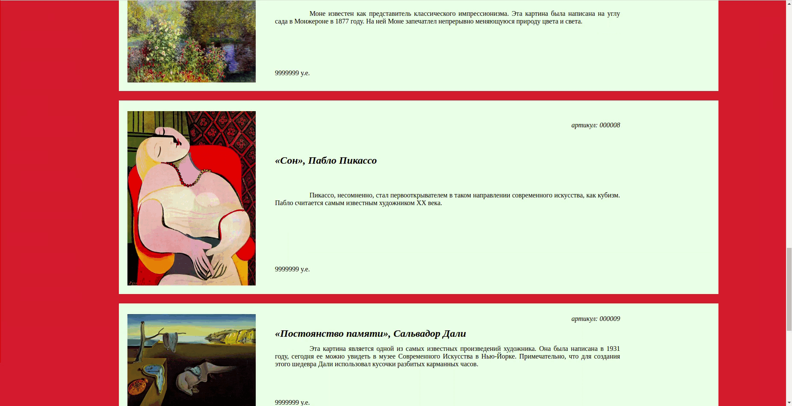
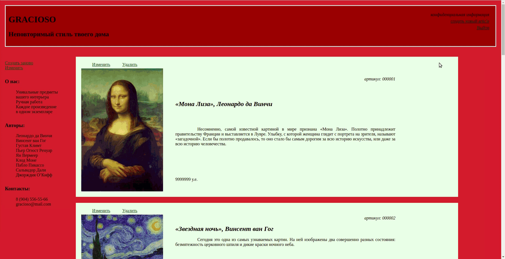
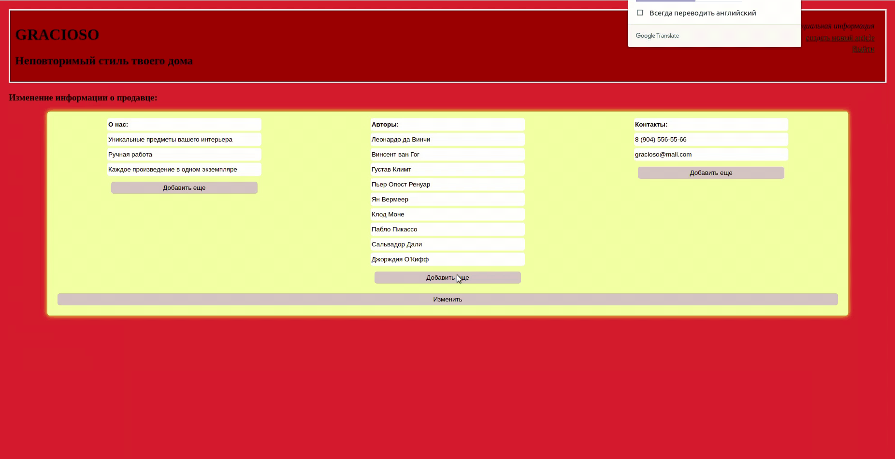

Картинная галерея "Грациозо"  

### Просмотр каталога картин:
На данной странице можно познакомиться с картинами, которые представлены в галерее, а так же информацией о них, и их текущей стоимости. Так же представлены информация о самой галерее.  

### Личный кабинет администратора:

### Добавление новых работ в каталог:
Добавление новых работ с их названием, именем автора, описанием и фотоминиатюрой.  

 

### Редактирование данных :
Редактирование контактных данных, а также общей информации о галерии.  

 

### Установка и запуск приложения:
команда npm i  
команда npm start

### Планы развития приложения:
Возможности покупателя:  
-детальный просмотр картины
-заявка на интересующую картину

### Тспользованные технологии:
Node  
Express  
MongoDB  
Mongoose  

### Над приложением работала:

* [Мария Богданова](https://github.com/Mariya-Bogdanova);
